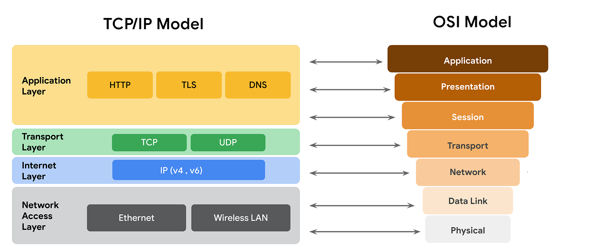
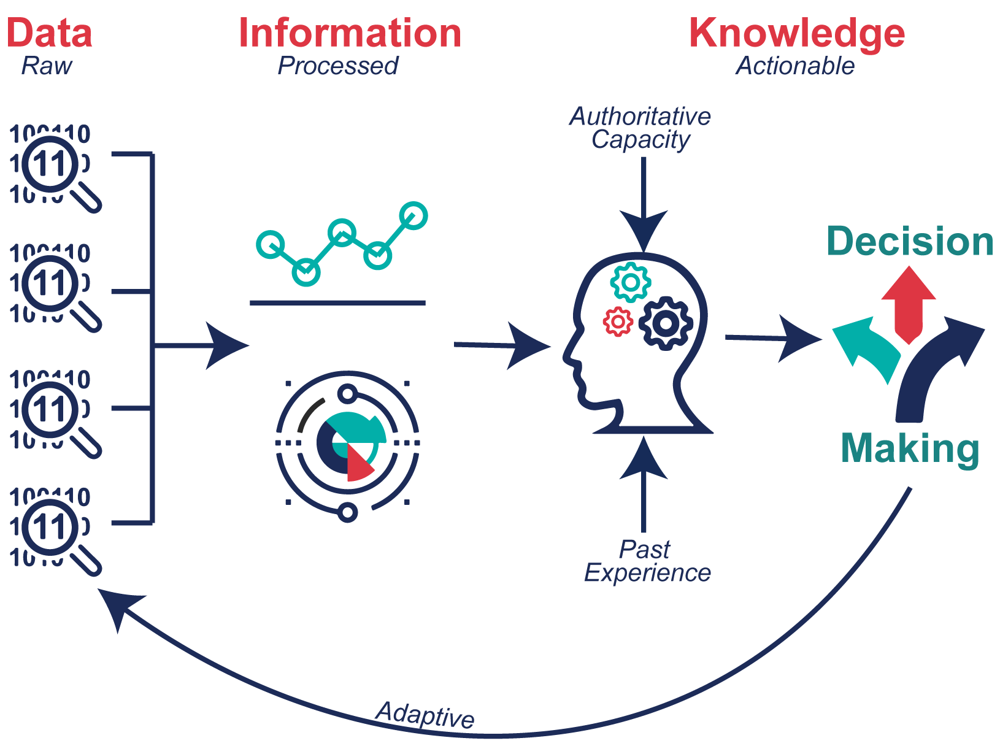
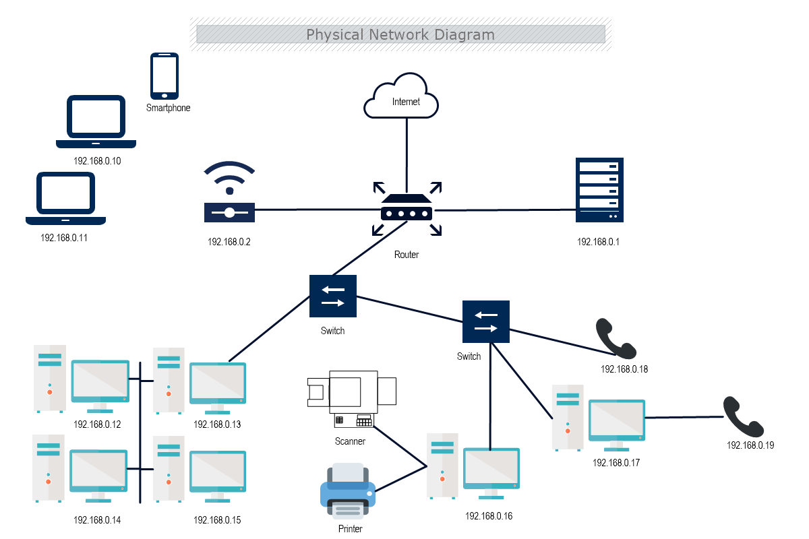
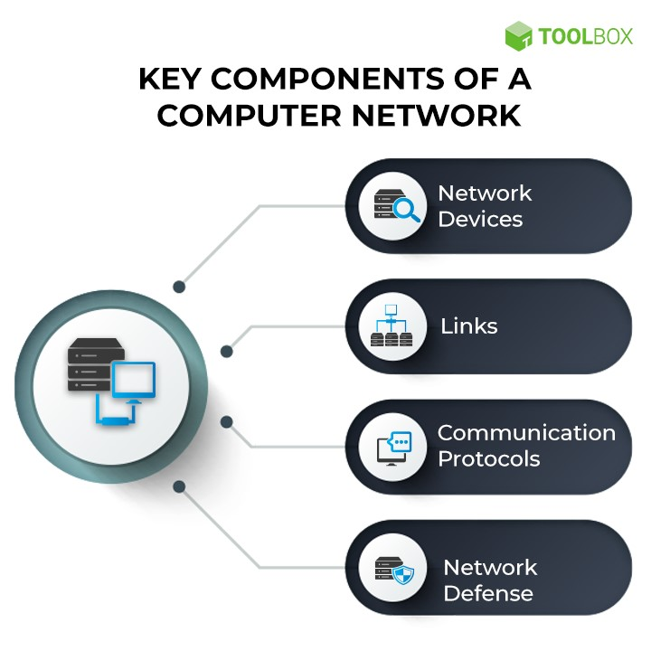
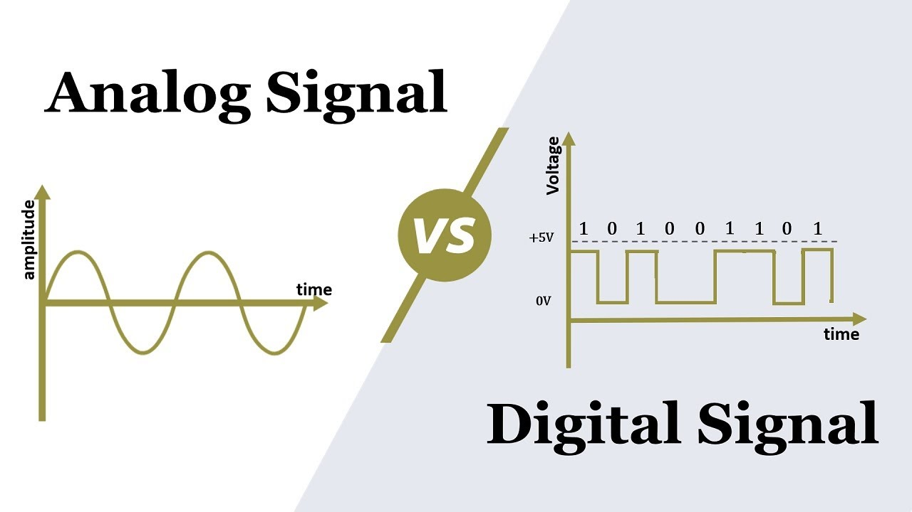
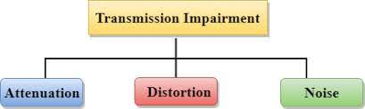
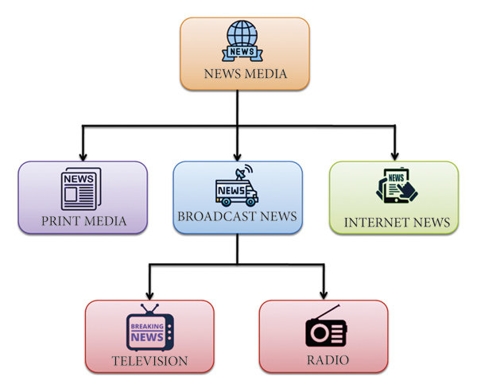
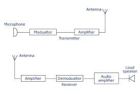
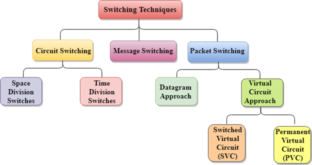
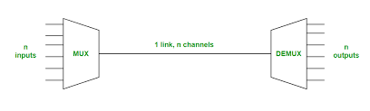

# Assignment of Unit 1

## 1. Describe OSI layer and its importance in computer networing.
 ASSIGNMENT OF UNIT 1

## **1. Describe OSI layer and its importance in computer networing.**

### _The open system interconnection **(OSI)** model is defined as a standard model used to describe the flow of information from one computing device t another operating in a networking environment._   
### The model defines a set of rules and requirements for data communication and interoperability between different devices, products, and software in a network infrastructure. The OSI model is split into seven fundamental layers (bottom to top): Physical, Data Link, Network, Transport, Session, Presentation, and Application.

### **Importance of OSI Model :** 

**1. Handles networking vulnerabilities & security issues**

**2. Suitable for cloud-first environments**

**3. Helps create an inventory of physical assets, security resources, & applications**

**4. Allows updates to standard OSI models**

**5. Beneficial for equipment manufacturers**

## **2. Describe TCP/IPv4 protocol suite.**

### The TCP/IP suite is a set of protocols used on computer networks today (most notably on the internet). It provides an end-to-end connectivity by specifying how data should be packetized, addressed, transmitted, routed and received on a TCP/IP network. This functionality is organized into four abstraction layers and each protocol in the suite resides in a particular layer.

### The TCP/IP suite is named after its most important protocols, the Transmission Control Protocol (TCP) and the Internet Protocol (IP). Some of the protocols included in the TCP/IP suite are:

* **ARP (Address Resolution Protocol)** – used to associate an IP address with a MAC address.
* **IP (Internet Protocol)** – used to deliver packets from the source host to the destination host based on the IP addresses.
* **ICMP (Internet Control Message Protocol)** – used to detects and reports network error conditions. Used in ping.
* **TCP (Transmission Control Protocol)** – a connection-oriented protocol that enables reliable data transfer between two computers.
* **UDP (User Datagram Protocol)** – a connectionless protocol for data transfer. Since a session is not created before the data transfer, there is no guarantee of data delivery.
* **FTP (File Transfer Protocol)** – used for file transfers from one host to another.
* **Telnet (Telecommunications Network)** – used to connect and issue commands on a remote computer.
* **DNS (Domain Name System)** – used for host names to the IP address resolution.
* **HTTP (Hypertext Transfer Protocol)** – used to transfer files (text, graphic images, sound, video, and other multimedia files) on the World Wide Web.

## **3. Differenciate between OSI and TCP/IPv4.**

### **OSI Model**

1. The full form of OSI is Open System Interconnection.

2. It is a structured model which deals which the functioning of a network.

3. It comprises seven layers:

* Physical Layer
* Data link Layer
* Network Layer
* Transport Layer
* Session Layer
* Presentation Layer
* Application Layer

4. It follows a vertical approach.

5. An OSI Model is a reference model, based on which a network is created.

6. It is protocol independent.

### **TCP/IPv4**

1. The full form of TCP/IP id Transmission Control Protocol/Internet Protocol.

2. It is a communication protocol that is based on standard protocols and allows the connection of hosts over a network.

3. It comprises of four layers:

* Network Interface Layer
* Internet Layer / Routing Layer
* Transport Layer / Connection-oriented layer
* Application Layer / Session Layer
4. It follows a horizontal approach.
5. The TCP/IP is the implementation of the OSI Model.
6. It is protocol dependent.

## **4. What is data and information?**

### **Data** is defined as a collection of individual facts or statistics. Data can come in the form of text,observations, figures, images, numbers, graphs, or symbols. Data is a raw form of knowledge and, on its own,doesn't carryany significance or purpose. 

### **Information** is defined as knowledge gained through study, communication, research, or instruction. Essentially, information is the result of analyzing and interreting pieces of data. Whereas data is the individual figures, numbers,or graphs, informationid the perception of those pieces of knowledge.

## **5. What is computer networking?**

### A **Computer networking** is a system that connects two or more computing devices for transmitting and sharing information. Computing devices include everything from a mobile phone to a server. These devices are connected using physical wires such as fiber optics, but they can also be wireless.

### **Components of a Computer Network :**

**1. Network Devices**

Network devices or nodes are computing devices that need to be linked in the network. Some network devices include:

**Computers, mobiles, and other consumer devices:** These are end devices that users directly and frequently access. For example, an email originates from the mailing application on a laptop or mobile phone.

**Servers:** These are application or storage servers where the main computation and data storage occur. All requests for specific tasks or data come to the servers.

**Routers:** Routing is the process of selecting the network path through which the data packets traverse. Routers are devices that forward these packets between networks to ultimately reach the destination. They add efficiency to large networks.

**Switches:** Repeaters are to networks what transformers are to electricity grids—they are electronic devices that receive network signals and clean or strengthen them. Hubs are repeaters with multiple ports in them. They pass on the data to whichever ports are available. Bridges are smarter hubs that only pass the data to the destination port. A switch is a multi-port bridge. Multiple data cables can be plugged into switches to enable communication with multiple network devices.

**Gateways:** Gateways are hardware devices that act as ‘gates’ between two distinct networks. They can be firewalls, routers, or servers.

**2. Links**

Links are the transmission media which can be of two types:

* **Wired:** Examples of wired technologies used in networks include coaxial cables, phone lines, twisted-pair cabling, and optical fibers. Optical fibers carry pulses of light to represent data.

* **Wireless:** Network connections can also be established through radio or other electromagnetic signals. This kind of transmission is called ‘wireless’. The most common examples of wireless links include communication satellites, cellular networks, and radio and technology spread spectrums. Wireless LANs use spectrum technology to establish connections within a small area.

**3. Communication protocols**

A communication protocol is a set of rules followed by all nodes involved in the information transfer. Some common protocols include the internet protocol suite (TCP/IP), IEEE 802, Ethernet, wireless LAN, and cellular standards. TCP/IP is a conceptual model that standardizes communication in a modern network. It suggests four functional layers of these communication links:

* **Network access layer:** This layer defines how the data is physically transferred. It includes how hardware sends data bits through physical wires or fibers.

* **Internet layer:** This layer is responsible for packaging the data into understandable packets and allowing it to be sent and received.

* **Transport layer:** This layer enables devices to maintain a conversation by ensuring the connection is valid and stable.

* **Application layer:** This layer defines how high-level applications can access the network to initiate data transfer.

**4. Network Defense**

While nodes, links, and protocols form the foundation of a network, a modern network cannot exist without its defenses. Security is critical when unprecedented amounts of data are generated, moved, and processed across networks. A few examples of network defense tools include firewall, intrusion detection systems (IDS), intrusion prevention systems (IPS), network access control (NAC), content filters, proxy servers, anti-DDoS devices, and load balancers.

 226 changes: 226 additions & 0 deletions226  
Unit2.md

#  Assignment of Unit 2

## **1. What is signal? Define analog and digital signal.**

### An electrical or electromagnetic quantity (current, voltage, radio wave, micro wave, etc.) that carries data or information from one system (or network) to another is called a signal.

### There are two types of signals are:

* **1. Analog Signal**

A signal which is a continuous function of time and used to carry the information is known as an analog signal. An analog signal represents a quantity analogous to another quantity, for example, in case of an analog audio signal, the instantaneous value of signal voltage represents the pressure of the sound wave.

* **2. Digital Signal**

A signal that is discrete function of time, i.e. which is not a continuous signal, is known as a digital signal. The digital signals are represented in the binary form and consist of different values of voltage at discrete instants of time.

## **2. Differentiate between bandwidth, throughput, and speed with example?**

### **1. Bandwidth**

### Bandwidth is the quantity of data that can be transferred over a network in a given amount of time. It refers to the network/transmission medium's data carrying capability. In computing, the maximum pace of data flow via a particular route is known as the bandwidth. Network bandwidth, data bandwidth, and digital bandwidth are all examples of bandwidth.

### Bandwidth also refers to the frequency range between the lowest and highest attainable frequency. Analog signal bandwidth is measured in Hertz.

### It is always better to have a wide bandwidth because it enables more users/subscribers to access the network at the same time with lesser traffic or network congestion.

### **2. Throughput**

### Throughput is the measurement of the amount of data being transmitted across a network, interface, or channel in a given length of time. Throughput is also known as "effective data rate" or "payload rate". In general, throughput refers to the pace at which something is produced or processed.

### Throughput, also known as "network throughput", is the rate of successful message transmission through a communication channel in communication networks such as Ethernet or packet radio. The data included in these messages may be transmitted through a physical or logical link, or it may transit through a network node.

[Difference between Bandwidth and 
Throughput](https://www.tutorialspoint.com/difference-between-bandwidth-and-throughput)

### **3. Speed**

### The rate of transferring the data is known as Speed. The speed is also measured by Mbps (Megabits per second). The speed of the internet to load web pages, videos, files, etc. is known as Internet speed. Speed is a major factor in the internet for numerous activities such as streaming, uploading, downloading games, etc.

[Difference between Bandwidth and Speed](https://www.tutorialspoint.com/difference-between-bandwidth-and-speed)

## **3. What is the theoretical data transfer rate(bps) in the medium of 1000Mhz bandwidth?**

### The theorrtical data transfer rate in the medium of 1000Mhz bandwidth is 10^9 bits per second(bps), or 1 Gbps(Gigabit per second). The theoretical data transfer rate (in bits per second, bps) in a communication channel is determined by the bandwidth of the channel and the modulation scheme used. The relationship between bandwidth (B) and data transfer rate (R) is given by the Nyquist-Shannon theorem, which states:

**R=2XB**

Where:

* **R** is the data transfer rate in bps,
* **B** is the bandwidth in hertz(Hz).

In your case, if the bandwidth is 1000 MHz, you need to convert it to hertz by multiplying it by 10^6 (since 1MHz = 10^6 Hz.)

B = 1000 MHz X 10^6 Hz/MHz = 10^9 Hz

Now, you can use the  Nyquist-Shannon theorem to find the theoretical data transfer rate:

R = 2 X 10^9 bps

So, the theoretical data transfer rate in a medium with a bandwidth of 1000 MHz is 2 X 10^9 bps.

## **4. What is transmission impairements? Describe each factors?**

### Transmission impairments refer to the difference between the transmitted and received signals in a communication system due to imperfections in the transmission medium. There are three main types of transmission impairments: 

**1.Signal Distortion:** This alters the shape of the signals, especially composite signals. It can be caused by environmental parameters, properties of the transmission medium, and the distance between the transmission end and receiving end. Signal distortion can be further divided into two types:

**Frequency Distortion:** This occurs when frequency components of the signal undergo unequal levels of attenuation, changing the waveshape of the signal.

**Phase or Delay Distortion:** This happens when frequency components of the composite signal propagate through the transmission medium at different velocities, introducing a delay in the signal reaching the receiving end and causing a phase difference between the signal at the receiving end and the transmitting end.

**2. Attenuation:** This is the decrease in signal strength during transmission, making it harder to receive at the other end. It is primarily caused by the environment, which imposes resistance on the signal as it travels through the medium.

**3. Noises:** These are unwanted signals added to the transmitted signal, making it challenging to remove the noise at the receiving end. There are several types of noises, including thermal noise, induced noise, crosstalk, and impulse noise.

## **5. Describe types of Media?**

### Media refers to the physical or virtual channels through which information is transmitted. Media is the main means of communication for people in a society. It can fall under a receipt of information or a way to market, but however it is done, it is communicating something. It refers to the way that messages are delivered to individuals. The goal of media is to communicate the intended message effectively. 

### There are various types of media are: 

**1. Physical Media:**

Physical media refers to the physical components used for transmitting information such as wires, cables and devices like printers and computers. It includes copper wire, fiber optic cable, infrared (IR), radio waves, light beams, and others. The signal carrier in this type of media has a fixed frequency that does not change during
transmission. For examples: Copper Wires, Fiber Optics Cables, Coaxial Cables, Radio Waves, etc.

**2. Virtual Media:**

Virtual media or logical media is an abstraction provided by software
to represent different communication channels. These include serial ports, parallel ports, USB, Ethernet, Token Ring, Firewire, Bluetooth, WiFi, etc., which provide a common interface between computer hardware and applications running on the computer system. In virtual media, the signal carrier’s frequency can vary during transmission, allowing multiple users to share the same channel the signal carrier's frequency may vary depending upon the specific protocol being used. For examples: Internet, Social Media, Streaming Services, etc.

## **6. What is modulation and demodulation and its importance in data communication?**

### **Modulation:** 
Modulation is the process of encoding digital information onto an analog carrier signal for transmission.In other words, it involves varying certain properties of a carrier signal (such as amplitude, frequency, or phase) to represent digital data. The purpose of modulation is to allow the transmission of digital information over analog commmunication channels, which are better suited for long-distance and high-frequency transmission.

### **Demodulation:**
Demodulation is the process of extracting the original digital information from a modulated carrier signal. It is the reverse process of modulation. Demodulation is essential at the receiving end to recover the digital data transmitted over the communication channel.

### Importance in Data Communication:

**1.Compatibility with Communication Channels:** Analog communication channels, such as radio waves and wired connections, are often better suited for long-distance transmission. Modulation allows digital information to be transmitted over these analog channels efficiently.

**2.Bandwidth Efficiency:** Modulation techniques help in utilizing the available bandwidth more efficiently. By modulating a carrier signal, multiple signals can share the same communication channel without interference, allowing for higher data transmission rates.

**3. Reduced Attenuation and Interference:** Analog signals, especially at higher frequencies, can experience less attenuation and interference compared to digital signals. Modulating digital data onto an analog carrier helps overcome these challenges during transmission.

**4. Improved Signal-to-Noise Ratio:** Modulation can enhance the signal-to-noise ratio of a communication system. By shifting the information into a different frequency range (modulation), the signal becomes less susceptible to noise and distortion during transmission.

**5. Long-Distance Communication:** Analog signals, particularly in the radio frequency range, can travel longer distances without significant loss of signal strength. Modulation allows digital information to be transmitted over long distances using these analog channels.

**6. Multiplexing:** Modulation enables multiplexing, where multiple signals can be combined and transmitted over the same channel. This is crucial for efficient utilization of resources in telecommunications.

**7. Versatility:** Different modulation techniques (e.g., amplitude modulation, frequency modulation, phase modulation) offer versatility in adapting to various communication channel characteristics and requirements.

### **7. Describe various types of switching in network communication?**

### **Switching** in network communication refers to the method used to forward data from the source to the destination across a network. There are three main types of switching: 

**1. Circuit Switching:**
 In circuit switching, a dedicated communication path is established between two devices for the duration of their conversation. The path remains reserved exclusively for those devices until the communication is complete.

**Characteristics:**

* Continuous connection during the entire communication session.
* Dedicated resources for the entire duration, even if no data is being transmitted.
* Commonly used in traditional telephone networks for voice communication.

**Advantages:**

* Predictable and consistent performance.
* Low latency for real-time communication.

**Disadvantages:**

* Inefficient use of resources when the connection is idle.
* Scalability challenges for a large number of simultaneous connections.

**2. Packet Switching:**
Packet switching breaks data into small packets and transmits them independently over the network. Each packet can take a different route to reach the destination, and they are reassembled at the destination.

**Characteristics:**

* Data is divided into packets, and each packet contains a portion of the message along with destination information.
* Each packet is transmitted independently and may follow different routes to reach the destination.
* Used in modern computer networks, including the Internet.

**Advantages:**

* Efficient use of network resources as bandwidth is shared dynamically.
* Scalable for a large number of connections.
* Robust and resilient to network failures.

**Disadvantages:**

* Variable latency due to different routes and potential packet reordering.
* Overhead in packet header and processing.

**3. Message Switching:**
Message switching involves the entire message being forwarded from the source to the destination. The message is stored and forwarded through a series of network nodes until it reaches its destination.

**Characteristics:**

* The entire message is treated as a unit and is stored and forwarded through the network.
* Nodes in the network may temporarily store the message before forwarding it to the next node.
* Not commonly used due to its inefficiency compared to packet switching.

**Advantages:**

* Simplicity in terms of message handling.
* Less complex than packet switching in terms of routing and addressing.

**Disadvantages:**

* Inefficient use of network resources, as the entire message must be transmitted before reaching the destination.
* Higher latency for large messages.

### **8. What is multiplexing and its usage?**

### **Multiplexing** is a technique used in telecommunications and computer networks to combine mulitple signals or data streams into a single transmission medium, allowing for efficient use of resources. The Primary goal of multiplexing is to transmit multiple signals over a shared communication channel simultaneously.

### The types of multiplexing are :

* **Time Division Multiplexing (TDM)**
* **Frequency Division Multiplexing (FDM)**
* **Wavelength Division Multiplexing (WDM)**
* **Code Division Multiplexing (CDM)**
* **Spatial Division Mutliplexing (SDM)**

**Usage of Multiplexing:**

* **Efficient Resource Utilization:** Multiplexing allows for the simultaneous transmission of multiple signals over the same communication channel, maximizing the use of available resources.

* **Increased Data Throughput:** By combining multiple signals, multiplexing increases the overall data throughput of a communication channel.

* **Cost Savings:** Multiplexing enables the sharing of infrastructure, reducing the need for additional physical channels and lowering overall costs.

* **Improved Network Efficiency:** Multiplexing is essential for optimizing the efficiency of communication networks, especially in scenarios where multiple users or data streams need to share the same medium.

0 comments on commit efbadde
Comment
Code
 
Leave a comment
 
 You’re not receiving notifications from this thread.
Footer
© 2024 GitHub, Inc.
Footer navigation
Terms
Privacy
Securit

