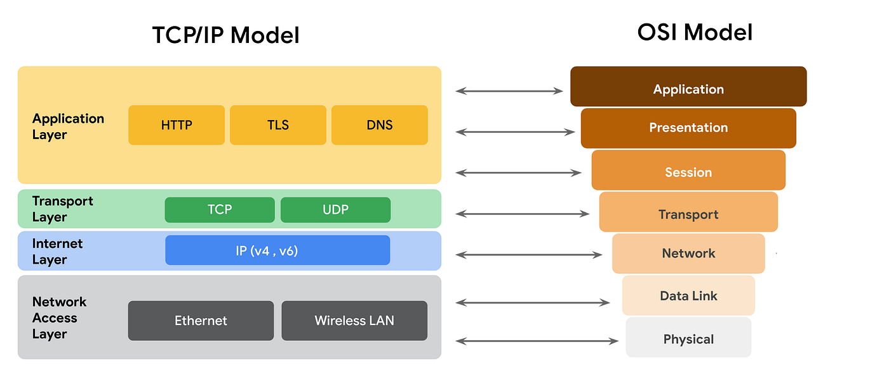
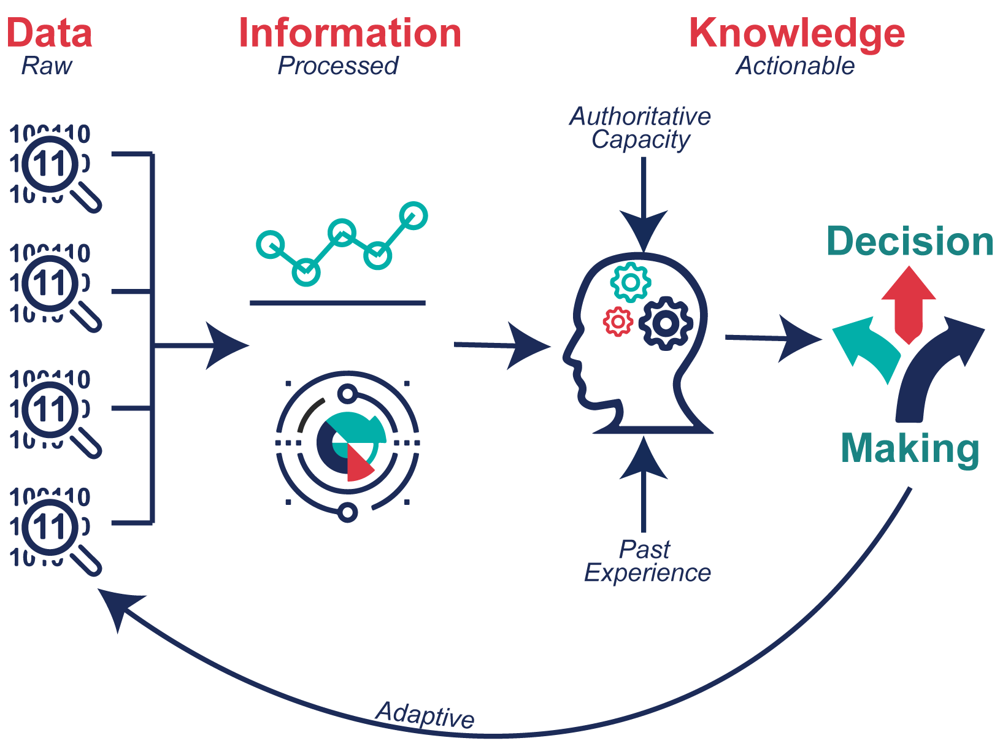

# ASSIGNMENT OF UNIT 1

## **1. Describe OSI layer and its importance in computer networing.**

### _The open system interconnection **(OSI)** model is defined as a standard model used to describe the flow of information from one computing device t another operating in a networking environment._   
### The model defines a set of rules and requirements for data communication and interoperability between different devices, products, and software in a network infrastructure. The OSI model is split into seven fundamental layers (bottom to top): Physical, Data Link, Network, Transport, Session, Presentation, and Application.

### **Importance of OSI Model :** 

**1. Handles networking vulnerabilities & security issues**

**2. Suitable for cloud-first environments**

**3. Helps create an inventory of physical assets, security resources, & applications**

**4. Allows updates to standard OSI models**

**5. Beneficial for equipment manufacturers**

## **2. Describe TCP/IPv4 protocol suite.**

### The TCP/IP suite is a set of protocols used on computer networks today (most notably on the internet). It provides an end-to-end connectivity by specifying how data should be packetized, addressed, transmitted, routed and received on a TCP/IP network. This functionality is organized into four abstraction layers and each protocol in the suite resides in a particular layer.

### The TCP/IP suite is named after its most important protocols, the Transmission Control Protocol (TCP) and the Internet Protocol (IP). Some of the protocols included in the TCP/IP suite are:

* **ARP (Address Resolution Protocol)** – used to associate an IP address with a MAC address.
* **IP (Internet Protocol)** – used to deliver packets from the source host to the destination host based on the IP addresses.
* **ICMP (Internet Control Message Protocol)** – used to detects and reports network error conditions. Used in ping.
* **TCP (Transmission Control Protocol)** – a connection-oriented protocol that enables reliable data transfer between two computers.
* **UDP (User Datagram Protocol)** – a connectionless protocol for data transfer. Since a session is not created before the data transfer, there is no guarantee of data delivery.
* **FTP (File Transfer Protocol)** – used for file transfers from one host to another.
* **Telnet (Telecommunications Network)** – used to connect and issue commands on a remote computer.
* **DNS (Domain Name System)** – used for host names to the IP address resolution.
* **HTTP (Hypertext Transfer Protocol)** – used to transfer files (text, graphic images, sound, video, and other multimedia files) on the World Wide Web.

## **3. Differenciate between OSI and TCP/IPv4.**

### **OSI Model**

1. The full form of OSI is Open System Interconnection.

2. It is a structured model which deals which the functioning of a network.

3. It comprises seven layers:

* Physical Layer
* Data link Layer
* Network Layer
* Transport Layer
* Session Layer
* Presentation Layer
* Application Layer

4. It follows a vertical approach.

5. An OSI Model is a reference model, based on which a network is created.

6. It is protocol independent.

### **TCP/IPv4**

1. The full form of TCP/IP id Transmission Control Protocol/Internet Protocol.

2. It is a communication protocol that is based on standard protocols and allows the connection of hosts over a network.

3. It comprises of four layers:

* Network Interface Layer
* Internet Layer / Routing Layer
* Transport Layer / Connection-oriented layer
* Application Layer / Session Layer
4. It follows a horizontal approach.
5. The TCP/IP is the implementation of the OSI Model.
6. It is protocol dependent.

## **4. What is data and information?**

### **Data** is defined as a collection of individual facts or statistics. Data can come in the form of text,observations, figures, images, numbers, graphs, or symbols. Data is a raw form of knowledge and, on its own,doesn't carryany significance or purpose. 

### **Information** is defined as knowledge gained through study, communication, research, or instruction. Essentially, information is the result of analyzing and interreting pieces of data. Whereas data is the individual figures, numbers,or graphs, informationid the perception of those pieces of knowledge.

## **5. What is computer networking?**

### A **Computer networking** is a system that connects two or more computing devices for transmitting and sharing information. Computing devices include everything from a mobile phone to a server. These devices are connected using physical wires such as fiber optics, but they can also be wireless.

### **Components of a Computer Network :**

**1. Network Devices**

Network devices or nodes are computing devices that need to be linked in the network. Some network devices include:

**Computers, mobiles, and other consumer devices:** These are end devices that users directly and frequently access. For example, an email originates from the mailing application on a laptop or mobile phone.

**Servers:** These are application or storage servers where the main computation and data storage occur. All requests for specific tasks or data come to the servers.

**Routers:** Routing is the process of selecting the network path through which the data packets traverse. Routers are devices that forward these packets between networks to ultimately reach the destination. They add efficiency to large networks.

**Switches:** Repeaters are to networks what transformers are to electricity grids—they are electronic devices that receive network signals and clean or strengthen them. Hubs are repeaters with multiple ports in them. They pass on the data to whichever ports are available. Bridges are smarter hubs that only pass the data to the destination port. A switch is a multi-port bridge. Multiple data cables can be plugged into switches to enable communication with multiple network devices.

**Gateways:** Gateways are hardware devices that act as ‘gates’ between two distinct networks. They can be firewalls, routers, or servers.

**2. Links**

Links are the transmission media which can be of two types:

* **Wired:** Examples of wired technologies used in networks include coaxial cables, phone lines, twisted-pair cabling, and optical fibers. Optical fibers carry pulses of light to represent data.

* **Wireless:** Network connections can also be established through radio or other electromagnetic signals. This kind of transmission is called ‘wireless’. The most common examples of wireless links include communication satellites, cellular networks, and radio and technology spread spectrums. Wireless LANs use spectrum technology to establish connections within a small area.

**3. Communication protocols**

A communication protocol is a set of rules followed by all nodes involved in the information transfer. Some common protocols include the internet protocol suite (TCP/IP), IEEE 802, Ethernet, wireless LAN, and cellular standards. TCP/IP is a conceptual model that standardizes communication in a modern network. It suggests four functional layers of these communication links:

* **Network access layer:** This layer defines how the data is physically transferred. It includes how hardware sends data bits through physical wires or fibers.

* **Internet layer:** This layer is responsible for packaging the data into understandable packets and allowing it to be sent and received.

* **Transport layer:** This layer enables devices to maintain a conversation by ensuring the connection is valid and stable.

* **Application layer:** This layer defines how high-level applications can access the network to initiate data transfer.

**4. Network Defense**

While nodes, links, and protocols form the foundation of a network, a modern network cannot exist without its defenses. Security is critical when unprecedented amounts of data are generated, moved, and processed across networks. A few examples of network defense tools include firewall, intrusion detection systems (IDS), intrusion prevention systems (IPS), network access control (NAC), content filters, proxy servers, anti-DDoS devices, and load balancers.

