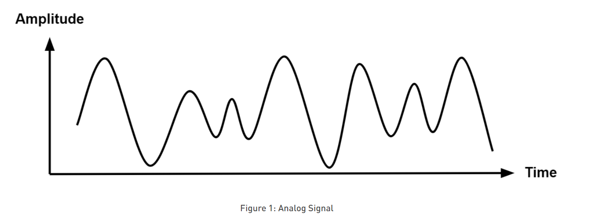
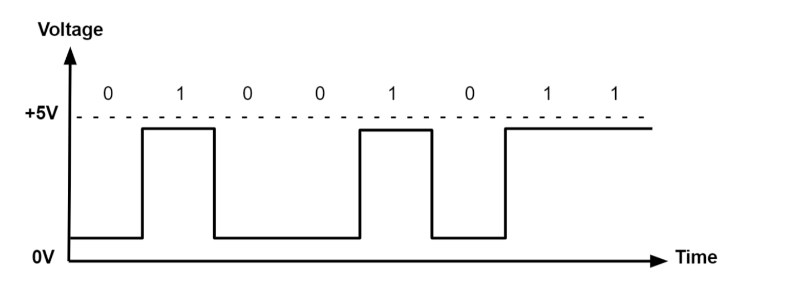

# UNIT 2
## Q.NO.1 What is signal? Define analog and digital signal.
### Ans: A signal is an electromagnetic or electrical current that carries data from one system or network to another. 
### An analog signal is a continuous electrical signal that varies smoothly and continuously over time. Unlike digital signals, which are discrete and represented by distinct values, analog signals can take on an infinite number of values within a given range. In the context of electronics and communication, analog signals are often used to represent real-world phenomena such as sound, light, temperature, and other physical quantities. Analog signals are characterized by their amplitude, frequency, and phase.

### A digital signal is a discrete, non-continuous signal that represents information using a series of distinct values or states. Unlike analog signals, which vary smoothly and continuously, digital signals are comprised of discrete elements often referred to as bits. Each bit can take on one of two possible values, typically represented as 0 or 1. Digital signals are commonly used in computing, telecommunications, and electronics because they are less susceptible to noise and distortion compared to analog signals. They also allow for more reliable storage, transmission, and processing of information. 

## Q.NO.2 Differentiate between bandwidth, throughput, and speed with example.
### Ans: Bandwidth, throughput and speed are terms often used in the context of computer networks and data communication, but they represent distinct concepts.
### Bandwidth: Bandwidth refers to the maximum rate of data transfer across a network or communication channel. It is typically measured in bits per second (bps) or a higher unit like kilobits per second (Kbps), megabits per second (Mbps), or gigabits per second (Gbps).
### Example: If you have an internet connection with a bandwidth of 100 Mbps, it means that the maximum rate at which data can be transferred between your device and the internet is 100 m egabits per second.

### Throughput: Throughput is the actual amount of data transferred successfully over a network or communication channel within a specific time period. It represents the realized data transfer rate and can be influenced by various factors, including network congestion, protocol overhead, and errors.
### Example: If you are downloading a file from the internet and the download speed is 80 Mbps, the throughput is 80 Mbps if the file downloads continuously at that rate without interruptions.

### Speed: Speed is a more general term that can be used to describe the rate at which something happens or the rate of data transfer. In the context of networks, it is often colloquially used as a synonym for bandwidth or throughput, but it's important to distinguish between these terms.
### Example: If someone says their internet speed is 50 Mbps, they might be referring to the bandwidth of their internet connection. However, without context, it could also be interpreted as the throughput they are currently experiencing during a specific task.

## Q.NO.3 What is the theoretical data transfer rate(bps) in the medium of 1000Mhz bandwidth?
The theorrtical data transfer rate in the medium of 1000Mhz bandwidth is 10^9 bits per second(bps), or 1 Gbps(Gigabit per second). The theoretical data transfer rate (in bits per second, bps) in a communication channel is determined by the bandwidth of the channel and the modulation scheme used. The relationship between bandwidth (B) and data transfer rate (R) is given by the Nyquist-Shannon theorem, which states:
R=2XB

Where:

R is the data transfer rate in bps,
B is the bandwidth in hertz(Hz).
In your case, if the bandwidth is 1000 MHz, you need to convert it to hertz by multiplying it by 10^6 (since 1MHz = 10^6 Hz.)

B = 1000 MHz X 10^6 Hz/MHz = 10^9 Hz

Now, you can use the Nyquist-Shannon theorem to find the theoretical data transfer rate:

R = 2 X 10^9 bps

So, the theoretical data transfer rate in a medium with a bandwidth of 1000 MHz is 2 X 10^9 bps.

### Q.NO.4 What is transmission impairments? Describe each factors?
### Ans: Transmission impairments refer to any unwanted alteration or degradation of a signal as it travels through a communication channel. These impairments can negatively impact the quality and reliability of data transmission. The factors of transmission impairments are:
### Attenuation:
* Definition: Attenuation is the loss of signal strength as it travels over a distance through a medium. It is often represented as a reduction in signal amplitude.
* Causes: Attenuation can result from factors such as resistance in conductors, scattering, and absorption of signal energy by the transmission medium.
* Effects: Reduced signal strength can lead to a decrease in signal quality and may result in errors or loss of data integrity over long distances.

### Noise:
* Definition: Noise refers to unwanted random signals that interfere with the transmitted signal. It can be introduced at various points in the communication system.
* Causes: External sources, electromagnetic interference, crosstalk, and thermal noise within electronic components can contribute to noise.
* Effects: Noise can distort the original signal, making it challenging to accurately interpret the transmitted information. It can lead to errors and impact the overall reliability of the communication system.

### Distortion:
* Definition: Distortion involves changes in the shape or characteristics of the signal waveform, often resulting from frequency-dependent effects in the transmission medium.
* Causes: Factors such as signal dispersion, multipath propagation, and frequency-dependent attenuation can cause distortion.
* Effects: Distortion can lead to signal misinterpretation and errors. It is particularly significant in high-frequency communication systems.

### Delay:
* Definition: Delay refers to the time it takes for a signal to travel from the source to the destination. Excessive delay can impact real-time applications and interactive communication.
* Causes: Delay can occur due to the finite speed of signal propagation in the transmission medium and processing delays in network equipment.
* Effects: Increased delay can result in latency, which can be problematic for applications requiring timely data delivery, such as voice and video communication.

### Jitter:
* Definition: Jitter refers to the variation in signal arrival times at the receiver. It can cause irregularities in the timing of signal components.
* Causes: Jitter can result from network congestion, varying propagation delays, and interference.
* Effects: In data communication, jitter can lead to packet loss, affect the synchronization of signals, and impact the performance of real-time applications.

## Q.NO.5 Describe types of Media?
### Ans: There are two types of media. They are as follow:
### i. Guided Media
### ii. Unguided Media
### i. Guided Media:
### Guided media, also known as bounded or wired media, use physical pathways to guide and direct signals. The signals are transmitted through these channels with the help of conductors. Some common types of guided media include:
* Twisted Pair Cable:
Description: Consists of pairs of insulated copper wires twisted together. It is widely used for telephone and Ethernet communication.
Advantages: Cost-effective and easy to install.
Disadvantages: Susceptible to electromagnetic interference.
* Coaxial Cable:
Description: Consists of a central conductor surrounded by insulation, a metallic shield, and an outer insulating layer. Used for cable television and broadband internet.
Advantages: Higher bandwidth compared to twisted pair cables.
Disadvantages: More expensive and thicker than twisted pair cables.
* Optical Fiber:
Description: Uses glass or plastic fibers to transmit signals using light pulses. It is commonly used for high-speed data transmission.
Advantages: High bandwidth, low signal loss, and immune to electromagnetic interference.
Disadvantages: Expensive to install and more fragile than copper cables.
### ii. Unguided Media:
Unguided media, also known as unbounded or wireless media, do not rely on physical conductors to transmit signals. Instead, they use air or space as the transmission medium. Common types of unguided media include:
* Wireless Transmission:
Description: Involves the use of radio waves or microwaves to transmit signals through the air.
Examples: Wi-Fi, Bluetooth, cellular networks.
Advantages: Mobility, flexibility, and no physical cables are required.
Disadvantages: Susceptible to interference, limited range, and potential security concerns.
* Satellite Communication:
Description: Involves the use of communication satellites to relay signals between ground stations.
Examples: Satellite television, satellite phones.
Advantages: Wide coverage, global communication capability.
Disadvantages: High latency, expensive infrastructure.
* Infrared Communication:
Description: Uses infrared signals for short-range communication.
Examples: Infrared remote controls, some short-range data transfer technologies.
Advantages: No interference with radio frequency devices, secure for short-range applications.
Disadvantages: Limited range, requires a line of sight.

## Q.NO.6 What is modulation and demodulation and its importance in data communication?
### Ans: 
#### Modulation (MOD): Modulation is the process of varying a carrier signal's properties, such as amplitude, frequency, or phase, in accordance with the information signal (data) that needs to be transmitted. The carrier signal acts as a carrier for the information, allowing it to be transmitted over a communication channel. Modulation is necessary to adapt the information signal to the characteristics of the transmission medium.

#### Demodulation (DEMOD): Demodulation is the reverse process of modulation. It involves extracting the original information signal from a modulated carrier signal at the receiving end of the communication system. Demodulation is essential for recovering the transmitted information so that it can be accurately processed or displayed.

### The importance of modulation & demodulation in data communication are:-
* Modulation allows the mapping of information onto carrier signals suitable for transmission over the chosen medium.
* Modulating the information onto a carrier allows for the use of specific modulation schemes that enhance noise immunity.
* Different signals can be modulated onto different carrier frequencies for simultaneous transmission.
* Modulation allows for packing multiple signals into the same frequency band without interference.
* Modulation allows for the use of carrier signals that are better suited for long-distance transmission.
* Modulation and demodulation help in converting information into a format that is compatible with the standards of the communication system.

### Q.NO.7 Describe various types of switching in network communication?
### Ans: The various types of switching in network communication are:-
* Circuit Switching: Circuit switching establishes a dedicated communication path between two devices for the duration of their conversation. The path remains dedicated and reserved exclusively for the duration of the communication session. Traditional telephone networks (PSTN - Public Switched Telephone Network) use circuit switching.
Real-time applications that require constant bandwidth, such as voice calls.
* Packet Switching: Packet switching breaks data into small packets that are individually routed from the sour ce to the destination. Each packet may take a different path through the network, and they are reassembled at the destination. Internet communication, including email, web browsing, and file transfers. Most modern computer networks, including local area networks (LANs) and wide area networks (WANs).
* Message Switching: Message switching involves sending entire messages as a whole from the source to the destination. The entire message is stored and forwarded through the network. Rarely used in modern networks due to inefficiency and high latency.Some early computer networks and telegraph systems used message switching.
* Virtual Circuit Switching (a variation of Circuit Switching): Virtual Circuit Switching is a hybrid of circuit switching and packet switching. It establishes a virtual path for data transmission, providing dedicated resources during the session but allowing dynamic allocation of resources as needed. Used in some older telephone networks and certain data communication scenarios. 

### Q.NO.8 What is multiplexing and its usage?
### Ans: Multiplexing is a technique used in communication networks to combine multiple signals or data streams into a single transmission medium for more efficient use of resources. The primary goal of multiplexing is to transmit multiple signals simultaneously over a shared communication channel, thereby maximizing the utilization of the channel's capacity. There are several types of multiplexing. They are as follow:
1. Frequency Division Multiplexing (FDM):
FDM divides the available frequency spectrum into multiple non-overlapping frequency bands, and each band carries a separate signal or data stream.
2. Time Division Multiplexing (TDM):
TDM allocates different time slots within a fixed time frame to multiple signals. Each signal is given a specific time interval for transmission.
3. Wavelength Division Multiplexing (WDM):
WDM operates in optical fiber communication systems and assigns different wavelengths of light to each data stream. Each wavelength represents a separate communication channel.
4. Code Division Multiplexing (CDM):
CDM assigns a unique code to each signal or user, and multiple signals can be transmitted simultaneously using the same frequency band.
5. Space Division Multiplexing (SDM):
SDM involves using different physical pathways (e.g., spatially separated antennas or channels) to transmit multiple signals concurrently.

### Usage of Multiplexing are:
* Efficient Utilization: Multiplexing allows multiple signals to share the same communication medium, optimizing the use of available resources.
* Increased Capacity: By transmitting multiple signals simultaneously, multiplexing increases the overall data capacity of communication channels.
* Cost-Effectiveness: Multiplexing reduces the need for additional physical channels or infrastructure, resulting in cost savings.
* Flexibility: Different multiplexing techniques offer flexibility in adapting to various communication scenarios, whether for voice, data, or multimedia applications.