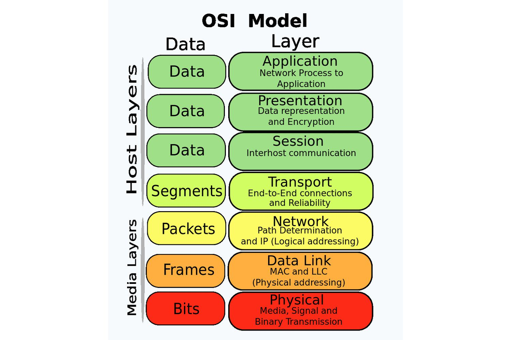
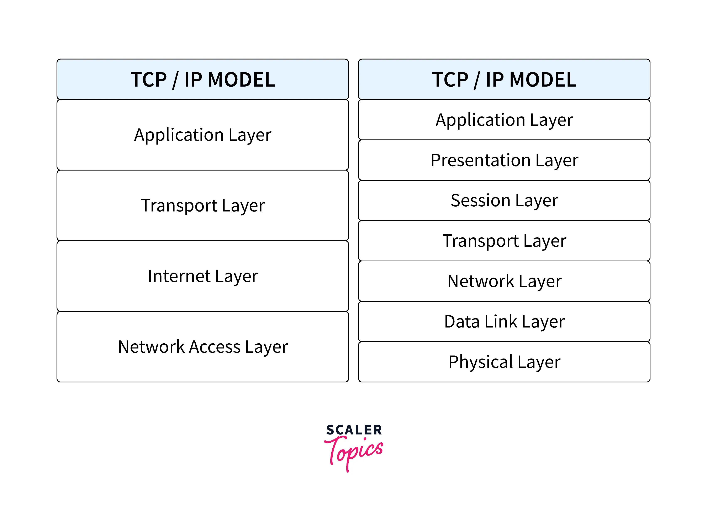
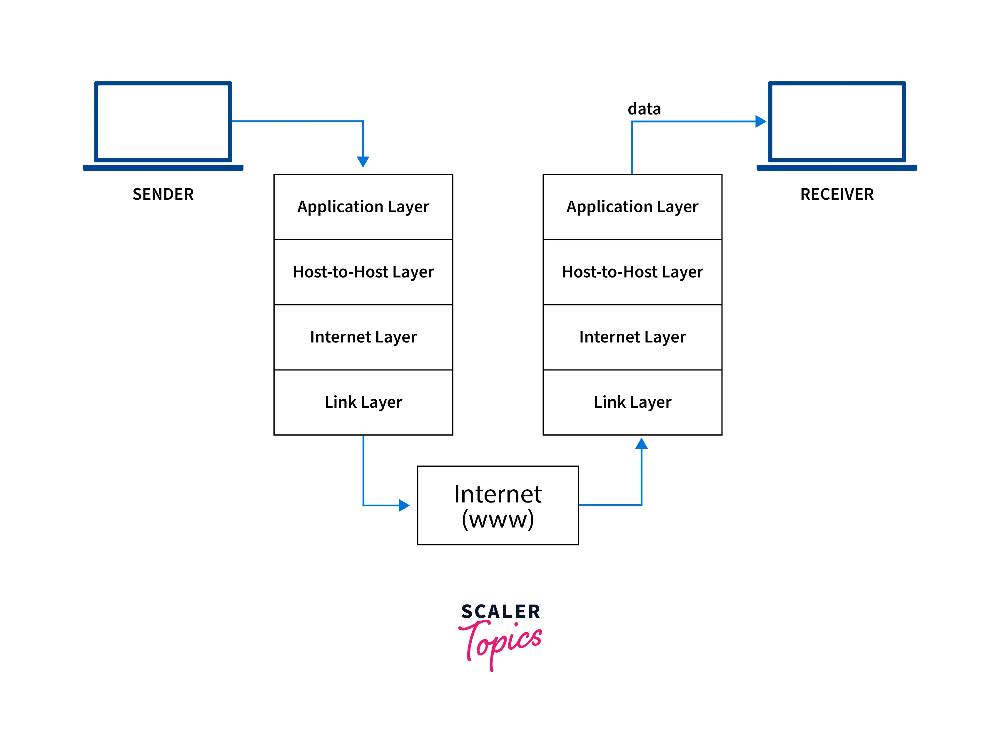

## Assignments 
# Unit-1
## 1. Describe OSI layer and its importance in computer networking.
#### Ans. OSI (open system interconnection) is a reference model for how applications communicate over a network. This model focuses on providing a visual design of how each communication layer is built on the top of the other starting with the physical cabling all the way to the application that's trying to coomunicate with other device on a network.OSI model is a layered framework that allows communication between all types of the computer system. It has 7 layers.

## 
## Its importance are:
#### The layers of the Open Systems Interconnection (OSI) model encapsulate every type of network communication across both software and hardware components. The model was designed to allow two standalone systems to communicate via standardised interfaces or protocols based on the current layer of operation.
- Shared understanding of complex systems: Engineers can use the OSI model to organize and model complex networked system architectures. They can separate the operating layer of each system component according to its main functionality. The ability to decompose a system into smaller, manageable parts via abstraction makes it easier for people to conceptualize it as a whole.
- Faster research and development: With the OSI reference model, engineers can understand their work better. They know which technological layer (or layers) they’re developing for when they create new, networked systems that need to communicate with each other. Engineers can develop networked systems and take advantage of a series of repeatable processes and protocols. 
- Flexible standardization: The OSI model does not specify the protocols to use between levels, but rather the tasks that protocols perform. It standardizes network communication development so people can rapidly understand, build, and decompose highly complex systems—all  without prior knowledge of the system. It also abstracts details, so engineers don’t require the understanding of every aspect of the model. In modern applications, the lower levels of networking and protocols are abstracted away to simplify system design and development.
## 2. Describe TCP/IPv4 protocol suite.
#### Ans. TCP/IP stands for Transmission Control Protocol/Internet Protocol and is a suite of communication protocols that makes data exchange between two devices possible. TCP/IP specifies how data should be packetized, addressed, transmitted, routed, and received on a network by providing end-to-end communication. As compared to the OSI model, which is a theoretical model, TCP/IP is an application and practical model.
####  IP stands for Internet Protocol and v4 stands for Version Four (IPv4). IPv4 was the primary version brought into action for production within the ARPANET in 1983. 
####  IP version four addresses are 32-bit integers which will be expressed in decimal notation. Example- 192.0.2.126 could be an IPv4 address. 
## 
## How Does the TCP/IP Protocol Work?
#### Whenever we send things like a simple text message, a file, or a video message over the internet, the TCP/IP model divides the data into packets, according to four-layered architecture. The data goes in order from the sender's side, and on the receiver's side, it follows the reverse order and is finally reassembled.
## 
#### TCP/IP is based on the client-server communication model, which means that a user of a first computer (the client) sends a service request to a second network computer or web hosting provider(server), such as forwarding a Web page. TCP/IP also uses point-to-point communication, which means that data is sent from one host computer to another within a defined network border. In TCP/IP model, each client request is unique and unrelated to previous ones. Hence, it is called stateless, and being stateless allows network channels to be used indefinitely.

#### Because the entire process is standardized, the TCP/IP model works. Without standardization, communication would go haywire, and fast internet service relies on efficiency. The TCP/IP model provides both efficiency and standardization. The TCP/IP model is the most effective way to send internet data because it is the global standard.
## 3. Differenciate between OSI and TCP/IPv4
#### OSI vs TCP/IPv4
- OSI stands for Open System Interconnection where as TCP/IPv4 stands for Transmission control protocol/ internet version 4.
- OSI has 7 layers where as It has only 4 layers.
- It is a structured model which deals which the functioning of a network where as It is a communication protocol that is based on standard protocols and allows the connection of hosts over a network.
- It follows a vertical approach where as TCP/IP follows horizontal approach.
- Delivery of the package is guarante in OSI model where as Delivery of the packages is not gurante in TCP/IP model.
- It is less reliable where as TCP/IP is more reliable than OSI.
## 4. What is data and information?
#### Ans. Data can be defined as a representation of facts, concepts, or instructions in a formalized manner, which should be suitable for communication, interpretation, or processing by human or electronic machine.

#### Data is represented with the help of characters such as alphabets (A-Z, a-z), digits (0-9) or special characters (+,-,/,*,<,>,= etc.)
## What is Information?
#### Information is organized or classified data, which has some meaningful values for the receiver. Information is the processed data on which decisions and actions are based.For the decision to be meaningful, the processed data must qualify for the following characteristics −

- Timely − Information should be available when required.
- Accuracy − Information should be accurate.
- Completeness − Information should be complete.
## 4. What is computer networking?
#### Ans. A computer network is a group of computers linked to each other that enables the computer to communicate with another computer and share their resources, data, and applications.
#### A computer network can be categorized by their size. A computer network is mainly of four types:
## 
