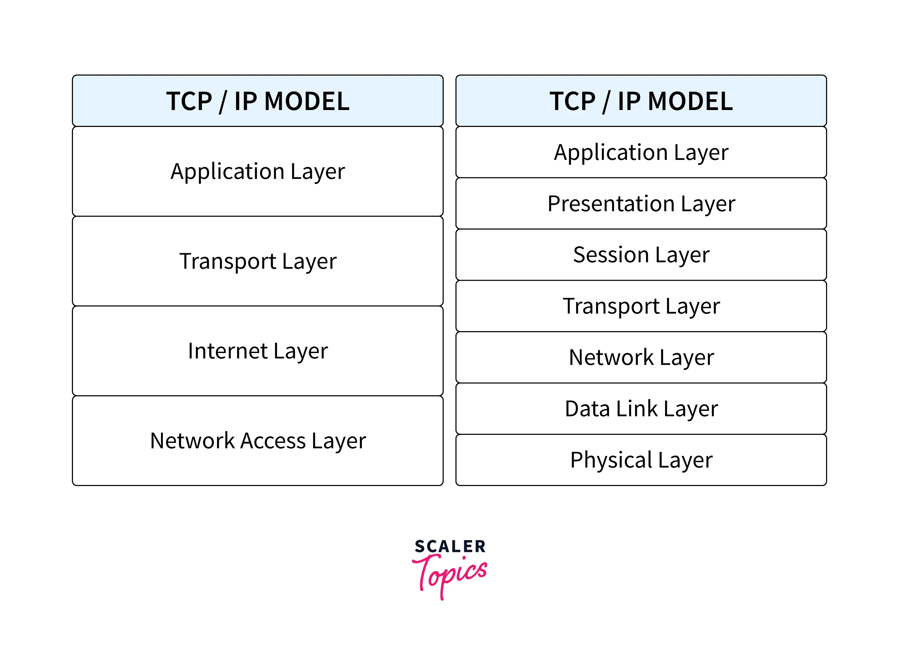
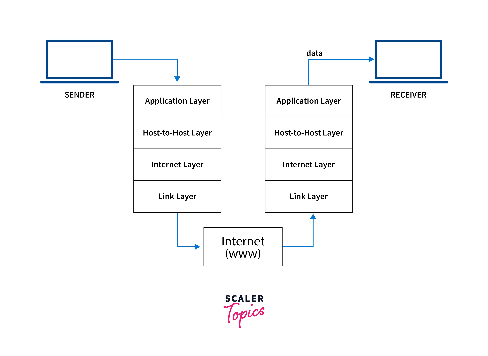

## Assignments 
# Unit-2
## 1. Describe TCP/IPv4 protocol suite.
#### Ans. TCP/IP stands for Transmission Control Protocol/Internet Protocol and is a suite of communication protocols that makes data exchange between two devices possible. TCP/IP specifies how data should be packetized, addressed, transmitted, routed, and received on a network by providing end-to-end communication. As compared to the OSI model, which is a theoretical model, TCP/IP is an application and practical model.
####  IP stands for Internet Protocol and v4 stands for Version Four (IPv4). IPv4 was the primary version brought into action for production within the ARPANET in 1983. 
####  IP version four addresses are 32-bit integers which will be expressed in decimal notation. Example- 192.0.2.126 could be an IPv4 address. 
## 
## How Does the TCP/IP Protocol Work?
#### Whenever we send things like a simple text message, a file, or a video message over the internet, the TCP/IP model divides the data into packets, according to four-layered architecture. The data goes in order from the sender's side, and on the receiver's side, it follows the reverse order and is finally reassembled.
## 
#### TCP/IP is based on the client-server communication model, which means that a user of a first computer (the client) sends a service request to a second network computer or web hosting provider(server), such as forwarding a Web page. TCP/IP also uses point-to-point communication, which means that data is sent from one host computer to another within a defined network border. In TCP/IP model, each client request is unique and unrelated to previous ones. Hence, it is called stateless, and being stateless allows network channels to be used indefinitely.

#### Because the entire process is standardized, the TCP/IP model works. Without standardization, communication would go haywire, and fast internet service relies on efficiency. The TCP/IP model provides both efficiency and standardization. The TCP/IP model is the most effective way to send internet data because it is the global standard.