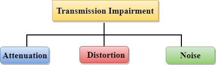
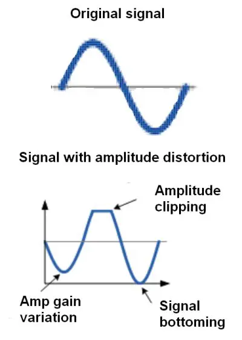
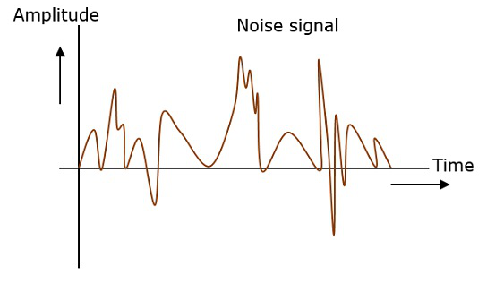
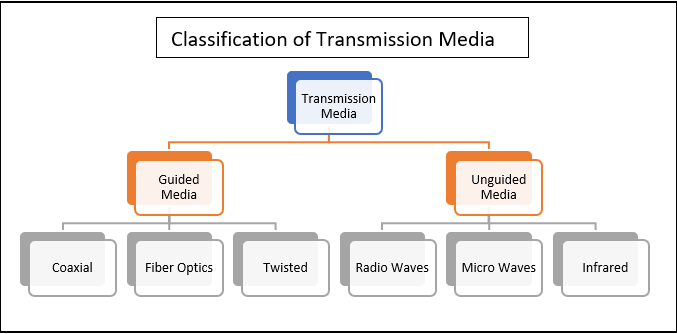

## Assignments 
# Unit-2
## 1. What is signal? Define analog and digital signal.
#### Ans. A signal is an electromagnetic or electrical current that carries data from one system or network to another. In electronics, a signal is often a time-varying voltage that is also an electromagnetic wave carrying information, though it can take on other forms, such as current. There are two main types of signals used in electronics: analog and digital signals.
## 
- Analog Signals: An analog signal is time-varying and generally bound to a range (e.g. +12V to -12V), but there is an infinite number of values within that continuous range. An analog signal uses a given property of the medium to convey the signal’s information, such as electricity moving through a wire.
## 
- Digital Signals: A digital signal is a signal that represents data as a sequence of discrete values. A digital signal can only take on one value from a finite set of possible values at a given time.
## 
## 2. Differentiate between bandwidth, throughput, and speed with example?
#### Ans. 
### Bandwidth
Bandwidth refers to the maximum amount of data that a network or communication channel can transmit in a given period. Higher bandwidth enables more data to be transmitted at once, resulting in faster network speeds.
### Throughput
In networking, throughput refers to the amount of data that can be transferred from one location to another within a given timeframe. It is a measure of how much information a system can process or handle successfully. Simply put, throughput measures the rate at which a network or device sends or receives data.

The throughput rate is also measured in bits per second (bps), megabytes per second (MB/s), or gigabytes per second (GB/s). A higher throughput indicates a faster data transfer rate. 
### Speed
Network speed is the rate at which data moves between two devices on a network. It is usually what people mean when talking about network and application performance. A faster network speed allows quicker data transfer. This results in faster downloads, uploads, and browsing.

Think of network speed as the flow rate of water through a pipe. Even large pipes limit water flow based on things like water pressure, the pipe shape, and any blockages.

Similarly, network speed depends on various network and device factors. These include the protocol for transferring data, a device's wired or wireless reception, and a server's ability to transfer data to multiple clients at once. Next, we'll explore these factors in detail.
## 3. What is the theoretical data transfer rate(bps) in the medium of 1000Mhz bandwidth?
#### Ans. 
#### The theoretical data transfer rate in a medium with a bandwidth of 1000 MHz is 1 gigabit per second (1 Gbps).
#### The theoretical data transfer rate is determined by the bandwidth of the communication medium. In this case, if the bandwidth is 1000 megahertz (MHz), you can think of it like a pipeline that can handle 1000 million cycles per second.

#### In data transfer, we measure the rate in bits per second (bps). So, with a 1000 MHz bandwidth, the theoretical data transfer rate is 1 billion bits per second, which is commonly expressed as 1 gigabit per second (1 Gbps). It's like the maximum speed at which information can travel through that communication channel.

## 4. What is transmission impairements? Describe each factors?
#### Ans. When a signal transmits from one transmission medium to other, the signal that is received may differ from the signal that is transmitted, due to various transmission impairment.
## 
* Attenuation: Attenuation is generally decreased in signal strength, by which the received signal will be difficult to receive at the receiver end. This attenuation happens due to the majority factor by environment as environment imposes a lot of resistance and the signal strength decreases as it tries to overcome the resistance imposed.
## 
* Distortion: Distortion means signals changes its form or shape. Distortion can occur in a composite signal made of different frequency.
## 
* Noise: The random or unwanted signal that mixed up with the original signal is called Noise.
## 

## 5. Describe types of Media?
#### Anss. In data communication terminology, a transmission medium is a physical path between the transmitter and the receiver i.e. it is the channel through which data is sent from one place to another. Transmission Media is broadly classified into the following types: 
## 
1. #### Guided Media: 
#### It is also referred to as Wired or Bounded transmission media. Signals being transmitted are directed and confined in a narrow pathway by using physical links. 
### Features:  

- High Speed
- Secure
- Used for comparatively shorter distances
2. #### Unguided Media: 
#### It is also referred to as Wireless or Unbounded transmission media. No physical medium is required for the transmission of electromagnetic signals. 

### Features:  

- The signal is broadcasted through air
- Less Secure
- Used for larger distances

## 7. What is modulation and demodulation and its importance in data communication?
## 8 Describe various types of switching in network communicaiton?
## 9. What is multiplexing and its usage?

