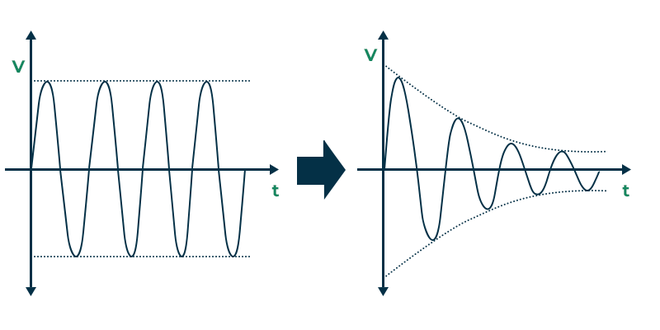
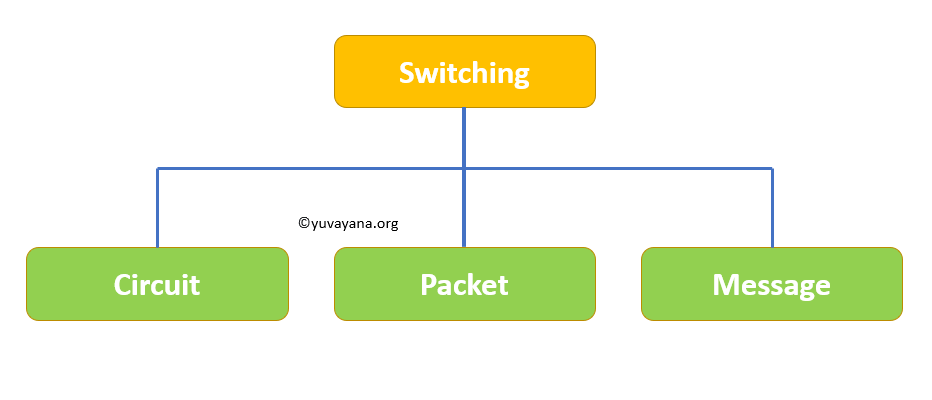
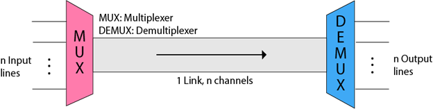

## Assignments 
# Unit-2
## 1. What is signal? Define analog and digital signal.
#### Ans. A signal is an electromagnetic or electrical current that carries data from one system or network to another. In electronics, a signal is often a time-varying voltage that is also an electromagnetic wave carrying information, though it can take on other forms, such as current. There are two main types of signals used in electronics: analog and digital signals.
## 
- Analog Signals: An analog signal is time-varying and generally bound to a range (e.g. +12V to -12V), but there is an infinite number of values within that continuous range. An analog signal uses a given property of the medium to convey the signal’s information, such as electricity moving through a wire.
## 
- Digital Signals: A digital signal is a signal that represents data as a sequence of discrete values. A digital signal can only take on one value from a finite set of possible values at a given time.
## 
## 2. Differentiate between bandwidth, throughput, and speed with example?
#### Ans. 
### Bandwidth
Bandwidth refers to the maximum amount of data that a network or communication channel can transmit in a given period. Higher bandwidth enables more data to be transmitted at once, resulting in faster network speeds.
### Throughput
In networking, throughput refers to the amount of data that can be transferred from one location to another within a given timeframe. It is a measure of how much information a system can process or handle successfully. Simply put, throughput measures the rate at which a network or device sends or receives data.

The throughput rate is also measured in bits per second (bps), megabytes per second (MB/s), or gigabytes per second (GB/s). A higher throughput indicates a faster data transfer rate. 
### Speed
Network speed is the rate at which data moves between two devices on a network. It is usually what people mean when talking about network and application performance. A faster network speed allows quicker data transfer. This results in faster downloads, uploads, and browsing.

Think of network speed as the flow rate of water through a pipe. Even large pipes limit water flow based on things like water pressure, the pipe shape, and any blockages.

Similarly, network speed depends on various network and device factors. These include the protocol for transferring data, a device's wired or wireless reception, and a server's ability to transfer data to multiple clients at once. Next, we'll explore these factors in detail.
## 3. What is the theoretical data transfer rate(bps) in the medium of 1000Mhz bandwidth?
#### Ans. 
#### The theoretical data transfer rate in a medium with a bandwidth of 1000 MHz is 1 gigabit per second (1 Gbps).
#### The theoretical data transfer rate is determined by the bandwidth of the communication medium. In this case, if the bandwidth is 1000 megahertz (MHz), you can think of it like a pipeline that can handle 1000 million cycles per second.

#### In data transfer, we measure the rate in bits per second (bps). So, with a 1000 MHz bandwidth, the theoretical data transfer rate is 1 billion bits per second, which is commonly expressed as 1 gigabit per second (1 Gbps). It's like the maximum speed at which information can travel through that communication channel.

## 4. What is transmission impairements? Describe each factors?
#### Ans. When a signal transmits from one transmission medium to other, the signal that is received may differ from the signal that is transmitted, due to various transmission impairment.
## 
* Attenuation: Attenuation is generally decreased in signal strength, by which the received signal will be difficult to receive at the receiver end. This attenuation happens due to the majority factor by environment as environment imposes a lot of resistance and the signal strength decreases as it tries to overcome the resistance imposed.
## 
* Distortion: Distortion means signals changes its form or shape. Distortion can occur in a composite signal made of different frequency.
## 
* Noise: The random or unwanted signal that mixed up with the original signal is called Noise.
## 

## 5. Describe types of Media?
#### Anss. In data communication terminology, a transmission medium is a physical path between the transmitter and the receiver i.e. it is the channel through which data is sent from one place to another. Transmission Media is broadly classified into the following types: 
## 
1. #### Guided Media: 
#### It is also referred to as Wired or Bounded transmission media. Signals being transmitted are directed and confined in a narrow pathway by using physical links. 
### Features:  

- High Speed
- Secure
- Used for comparatively shorter distances
2. #### Unguided Media: 
#### It is also referred to as Wireless or Unbounded transmission media. No physical medium is required for the transmission of electromagnetic signals. 

### Features:  

- The signal is broadcasted through air
- Less Secure
- Used for larger distances

## 7. What is modulation and demodulation and its importance in data communication?
#### Ans. Modulation is the process of converting data into radio waves by adding information to an electronic or optical carrier signal. A carrier signal is one with a steady waveform -- constant height, or amplitude, and frequency.
#### Demodulation is the process of extracting the original information-carrying signal from a modulated carrier wave, in order to recover the original data or message.
- Using Frequencies Efficiently:

Modulation helps send information using different radio frequencies, allowing many signals to travel together without getting mixed up. It's like having different radio stations on separate frequencies.
- Sending Signals Far Away:

Modulating signals onto carrier waves lets them travel long distances without losing strength. This is helpful for things like radio signals reaching from a broadcasting station to your car radio.
- Protecting Signals from Noise:

Modulation makes signals less affected by interference or static during transmission. It's like using a clear phone signal even when there's some background noise around.
- Combining Different Types of Information:

Modulation allows us to send various types of information (voice, video, data) at the same time. It's like multiple TV channels sharing the same cable without mixing up their shows.
- Getting Back the Original Information:

Demodulation is like unwrapping a packaged gift. It helps recover the original signal from the modulated one, ensuring we get the correct information at the receiving end.
## 8 Describe various types of switching in network communicaiton?
#### Ans. Switching is the process to forward packets coming in form one port to a port leading towards the destination. When data comes on a port it is called ingress, and when data leaves a port or goes it is called egress.
## 
1. Circuit Switching: When two nodes communicate with each other over a dedicated communication path it is called circuit switching.
2. Packet Switching: The packet switching is a switching technique in which the message is sent in one go, but it is divided into smaller pieces, and they are sent individually.
3. Message Switching: Message switching is a switching technique in which a message is transferred as a complete unit and routed through intermediate modes at which it is stored and forwarded.

## 9. What is multiplexing and its usage?
#### Ans. Multiplexing is a technique used to combine and send the multiple data streams over a single medium. The process of combining the data streams is known as multiplexing and hardware used for multiplexing is known as a multiplexer.

#### Multiplexing is achieved by using a device called Multiplexer (MUX) that combines n input lines to generate a single output line. Multiplexing follows many-to-one, i.e., n input lines and one output line.
## 
- The 'n' input lines are transmitted through a multiplexer and multiplexer combines the signals to form a composite signal.
- The composite signal is passed through a Demultiplexer and demultiplexer separates a signal to component signals and transfers them to their respective destinations.
## Advantages of Multiplexing:
- More than one signal can be sent over a single medium.
- The bandwidth of a medium can be utilized effectively.
